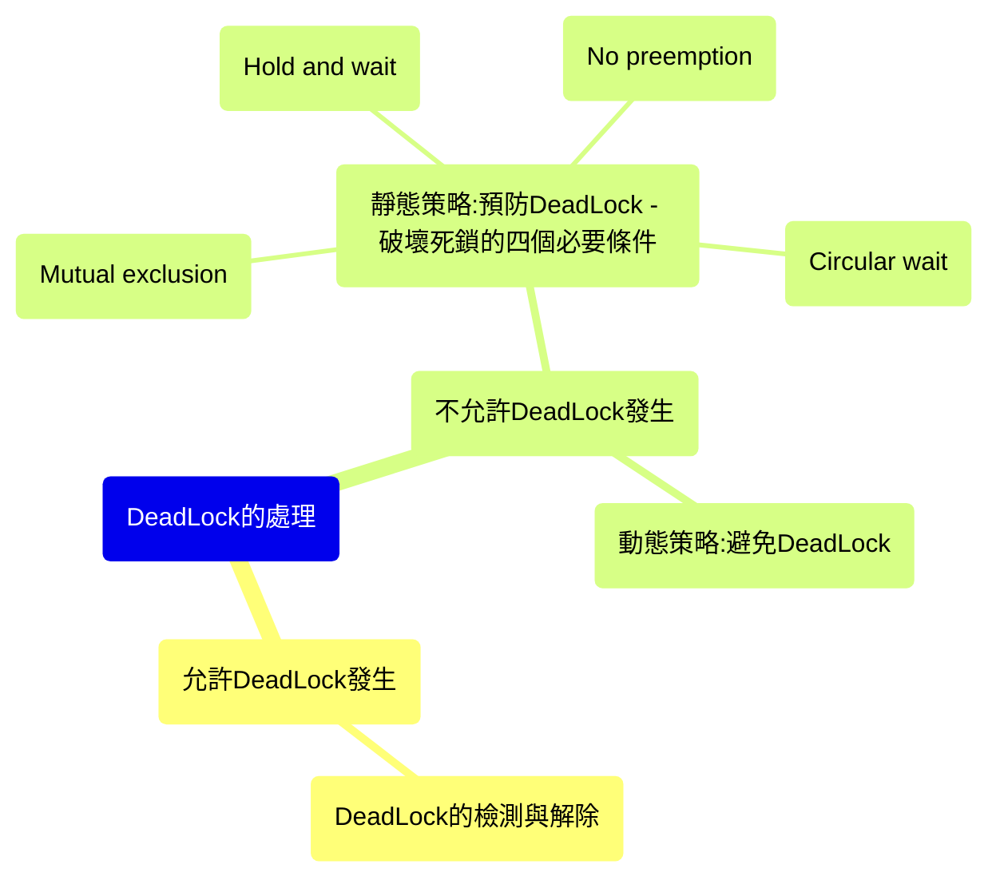

# DeadLock

```mermaid
mindmap
  root(DeadLock的處理)
    root --> a(允許DeadLock發生)
        a --> a1(DeadLock的檢測與解除)  
    root --> b(不允許DeadLock發生)
        b --> b1(動態策略:避免DeadLock)
        b --> b2(靜態策略:預防DeadLock - 破壞死鎖的四個必要條件)
            b2 --> b21(Mutual exclusion)
            b2 --> b22(Hold and wait)
            b2 --> b23(No preemption)
            b2 --> b24(Circular wait)
        
    
```