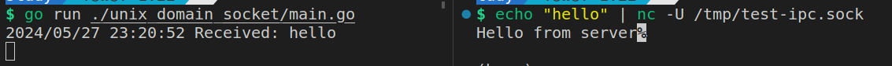

# Unix Domain Socket
> https://troydhanson.github.io/network/Unix_domain_sockets.html

`Unix domain socket`

另外在k8s中,透過`UDS`比起走複雜的網路路由,會快許多

## Unix Domain Socket vs TCP Socket

golang 中的 `net` 提供了 `TCP` 和 `Unix Domain Socket`封裝, 用起來基本一樣

unix socket:
```go
sockFileName := "/tmp/test-ipc.sock"
socket, err := net.Listen("unix", sockFileName)
if err != nil {
    log.Fatal(err)
}

```
tcp socket:
```go
socketAddr := ":8080"
socket, err := net.Listen("tcp", socketAddr)
if err != nil {
    log.Fatalln(err)
}
```


使用 `nc` 測試 `unix domain socket`:
> -U : Use UNIX domain socket

```sh
echo "hello" | nc -U /tmp/test-ipc.sock
```


